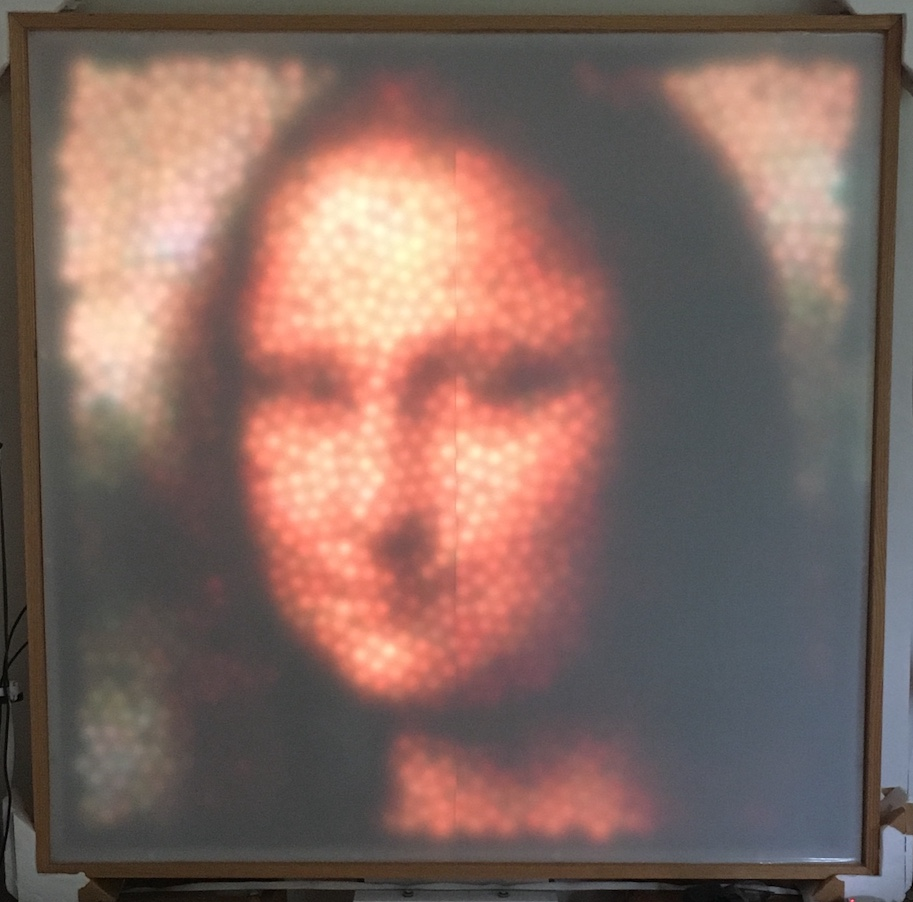

# display1593
Python code for Raspberry Pi controlling irregular LED display (with 1593 LEDs).

**Irregular LED Display showing a rendering of Mona Lisa painting.**



## Design
Display is 4x4 ft in size (1.2 x 1.2 metres) and has 1593 [WS2811 RGB LEDs](https://www.aliexpress.com/item/DC5V-WS2811-pixel-node-50node-a-string-non-waterproof-SIZE-13mm-13mm/1624010105.html) behind a translucent plastic screen.  The LEDs are arranged according to a randomly generated pattern whereby adjacent LEDs are roughly 50 mm apart (on average) but are not arranged in a classical x-y (Cartesian) grid.

The LEDs are controlled by two [Teensy 3.1 microcontrollers](https://www.pjrc.com/teensy/teensy31.html) connected to a [Raspberry Pi Zero](https://www.raspberrypi.org/products/raspberry-pi-zero/) by USB.

This repository contains the code installed on the Raspberry Pi.  The code for the Teensy microcontrollers and other information on the project is available at https://github.com/billtubbs/led-display-project.


## Display driver code

The main code for connecting to the display and setting LED intensities is in this module:
* [display1593.py](https://github.com/billtubbs/display1593/blob/master/display1593.py)

Here is a simple example showing how to connect to the display:

``` Python
>>> import display1593 as display
>>> dis = display.Display1593()
>>> dis.connect()
Finding Teensies...
Trying to connect to Teensies...
Connection to /dev/ttyACM1 (Teensy1) successful.
Connection to /dev/ttyACM0 (Teensy2) successful.
>>> dis.show_image("images/monalisa.png")
>>> 
```

Data on the LED co-ordinates, nearest neighbours etc. is currently stored in this file:
* [ledArray_data_1593.py](https://github.com/billtubbs/display1593/blob/master/ledArray_data_1593.py)


## Current list of display projects in this repository:
* clock.py - displays a round (analog) clock face
* digclock.py - displays a digital clock face
* shapes.py - displays random moving shapes of different colours
* schelling.py - simulation of the Schelling segregation model
* show_images.py - shows a series of recognisable images over time (e.g. Mona Lisa, David Bowie)
* stars.py - simulates a changing starry sky at night
