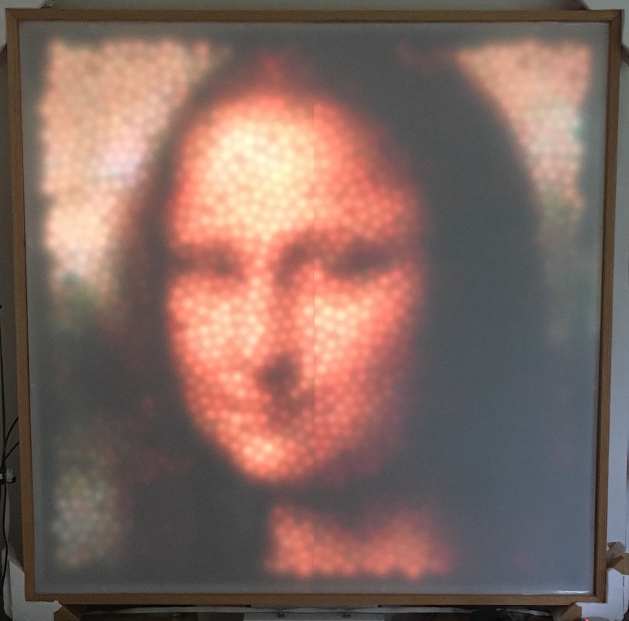

# display1593

Python code for a Raspberry Pi controlling the irregular 1593-LED display.

## Design

The display is approximately 4 ft by 4 ft (about 1.2 m by 1.2 m) and uses 1593 WS2811 RGB LEDs behind a translucent screen. The LEDs are arranged in an irregular pattern rather than a simple Cartesian grid, so the display driver must treat the LEDs as a flat list of addresses rather than as a conventional 2D image.

The LEDs are controlled by two Teensy 3.1 microcontrollers connected to a Raspberry Pi by USB.



This repository contains the code used on the Raspberry Pi to drive the display and to run example visualisation scripts.

## Package layout

The main display driver is now provided by the Python package in the `src/display1593` directory:

- `src/display1593/display1593.py` - the main display driver implementation
- `src/display1593/__init__.py` - exports the `Display1593` class

The repository also contains example scripts for displaying clocks, tests, and simulations.

## Quick start

Install the package in editable mode from the repository root:

```bash
pip install -e .
```

Example:

```python
from display1593 import Display1593

with Display1593() as dis:
    dis.clear_all()
    dis.set_led(0, (255, 0, 0))
    dis.show_now()
```

## Current projects in this repository

- `digclock.py` - displays a digital clock on the LED display
- `schelling.py` - runs a Schelling segregation simulation on the display
- `comm_led_test.py` - low-level communication and LED testing helper
- `frame_display_speed_test.py` - timing and performance checks for display updates
- `led_command_tests.py` - tests for the display command protocol

## Running digclock as a systemd service

To start the digital clock script automatically on boot, create a systemd service file at `/etc/systemd/system/myscript.service` with the following contents:

```ini
[Unit]
Description=Automatically launch Python script at startup
After=multi-user.target

[Service]
Type=idle
User=pi
ExecStart=/usr/bin/python3 /home/pi/code/display1593/digclock.py
Restart=always
RestartSec=5

[Install]
WantedBy=multi-user.target
```

Then enable and start it with:

```bash
sudo systemctl daemon-reload
sudo systemctl enable myscript.service
sudo systemctl start myscript.service
```

### Check status and logs

```bash
sudo systemctl status myscript.service
sudo journalctl -u myscript.service -n 50
```

### Temporarily stop the service

To stop it for the current session only:

```bash
sudo systemctl stop myscript.service
```

To start it again later:

```bash
sudo systemctl start myscript.service
```

To watch the script's own log file:

```bash
tail -f /home/pi/code/display1593/digclock.log
```

## Current development focus

The current work focuses on improving the display driver API, making the example scripts work cleanly with the newer package layout, and improving reliability for long-running display applications on the Raspberry Pi.
