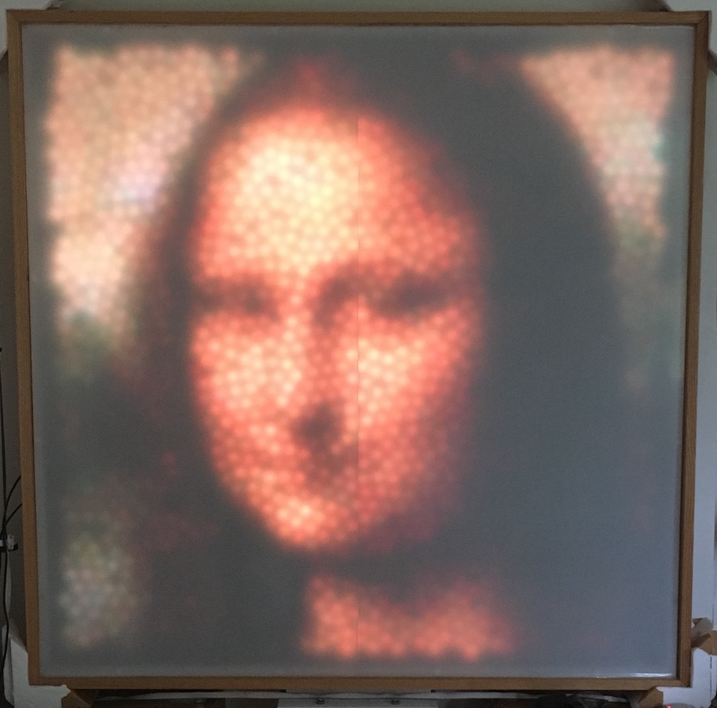

# display1593

Python code for a Raspberry Pi controlling the irregular 1593-LED display.

## Design

The display is approximately 4 ft by 4 ft (about 1.2 m by 1.2 m) and uses 1593 WS2811 RGB LEDs behind a translucent screen. The LEDs are arranged in an irregular pattern rather than a simple Cartesian grid, so the display driver must treat the LEDs as a flat list of addresses rather than as a conventional 2D image.

The LEDs are controlled by two Teensy 3.1 microcontrollers connected to a Raspberry Pi by USB.



This repository contains the code used on the Raspberry Pi to drive the display and to run example visualisation scripts.

## Package layout

The main display driver is now provided by the Python package in the `src/display1593` directory:

- `src/display1593/display1593.py` - the main display driver implementation
- `src/display1593/__init__.py` - exports the `Display1593` class

The repository also contains example scripts for displaying clocks, tests, and simulations.

## Quick start

Install the package in editable mode from the repository root:

```bash
pip install -e .
```

Example:

```python
from display1593 import Display1593

with Display1593() as dis:
    dis.clear_all()
    dis.set_led(0, (255, 0, 0))
    dis.show()
```

## Current projects in this repository

- `show_digclock.py` - displays a digital clock on the LED display
- `show_image.py` - displays a single image file on the LED display
- `play_frames.py` - plays a precomputed LED frame sequence (an `.npz`
  file, e.g. made from a video with
  [gen-video-frames](https://github.com/billtubbs/gen-video-frames)) in a
  loop: `python play_frames.py FRAMES.npz --fps 24`
- `schelling.py` - runs a Schelling segregation simulation on the display
- `fireplace/` - plays back precomputed fire animation frames
- `fluidsim/` - buoyancy-driven fluid flow simulation on the display
- `diagnostics/` - hardware, protocol and timing test scripts (run from
  the repo root), e.g. `check_led_neighbours.py`,
  `async_display_smoke_test.py`,
  `compare_modes.py`, `serial_worker_timing.py`, `comm_led_test.py`,
  `frame_display_speed_test.py`, `led_command_tests.py`

## Running digclock as a systemd service

To start the digital clock script automatically on boot, create a systemd service file at `/etc/systemd/system/myscript.service` with the following contents:

```ini
[Unit]
Description=Automatically launch Python script at startup
After=multi-user.target

[Service]
Type=idle
User=pi
WorkingDirectory=/home/pi/code/display1593
ExecStart=/usr/bin/python3 /home/pi/code/display1593/show_digclock.py
Restart=always
RestartSec=5

[Install]
WantedBy=multi-user.target
```

Then enable and start it with:

```bash
sudo systemctl daemon-reload
sudo systemctl enable myscript.service
sudo systemctl start myscript.service
```

### Check status and logs

```bash
sudo systemctl status myscript.service
sudo journalctl -u myscript.service -n 50
```

### Temporarily stop the service

To stop it for the current session only:

```bash
sudo systemctl stop myscript.service
```

To start it again later:

```bash
sudo systemctl start myscript.service
```

To watch the script's own log file:

```bash
tail -f /home/pi/code/display1593/show_digclock.log
```

## Playing animations: pipelined mode

By default every driver call is synchronous: each command is sent to the
boards and acknowledged before the call returns, and `show()` displays
the LED values you've just set. That's simple, but for animations that
update most of the display every frame, the Pi spends much of each frame
waiting on the serial link instead of computing the next one.

Pipelined mode overlaps the two. While your script builds frame *k+1*,
background threads (one per board) send frame *k* to the Teensys. It's
switched on with `Display1593(pipelined=True)`, or `dis.start_pipeline()`
after connecting.

### How `show()` works in each mode

`show(t=None)` takes an optional show time `t`, a `time.monotonic()`
value. With no `t`, the frame is shown as soon as possible.

| | Synchronous (default) | Pipelined |
|---|---|---|
| Which frame `show()` displays | The LED values just set | The frame set *before the previous* `show()` call |
| `show()` returns | After both boards have acknowledged | Immediately (see below) |
| `show(t)` | Waits until `t`, then shows | Schedules the show for `t`, then returns |

**In pipelined mode, every `show()` call displays the previous frame.**
Each call does two things:

1. Schedules the show command for time `t`. At `t`, the boards display
   the frame that has already been sent to them.
2. Starts sending the frame you've just set, ready to be displayed by the
   *next* `show()` call.

So the first frame appears at the second `show()` call. To display the
last frame, call `flush()` (or `flush(t)`) at the end. Leaving the
`with` block also flushes, but shows the last frame immediately.

Frame *k*'s data has the whole interval between the two show times to
reach the boards, however late in the frame your script made the call.

Timeline at 1 frame per second, starting at t = 0:

| Time | Your script | Boards |
|---|---|---|
| 0 to 1 | Sets frame 1, calls `show(1)` | Idle |
| 1 | | Nothing to display yet. Frame 1 starts sending |
| 1 to 2 | Sets frame 2, calls `show(2)` | Receiving frame 1 |
| 2 | | Display frame 1. Frame 2 starts sending |
| 2 to 3 | Sets frame 3, calls `show(3)` | Receiving frame 2 |
| 3 | | Display frame 2. Frame 3 starts sending |

Some details:

- **Set methods don't send anything.** `set_leds()`, `set_all_leds()`,
  `clear_all()` etc. stage their commands on the Pi until the next
  `show()` call, and return immediately.
- **Both halves update together.** At each show time, each board's
  thread waits until both boards have received the frame, then both send
  the show command.
- **Late frames are logged.** If a board hasn't finished receiving its
  frame by `t`, a warning names it, and the frame is shown as soon as both
  boards are ready. A `show(t)` call made after `t` has already passed is
  also logged.
- **Pacing is built in.** `show()` returns immediately unless
  `max_frames_ahead` (default 2) earlier `show()` calls are still waiting
  for their show time. In that case it waits, so your script can't get
  far ahead of the display.
- **Errors are raised.** If a board stops replying, the next `show()` or
  `flush()` raises the error (e.g. `TimeoutError`).

### Quick start: scrolling rainbow

```python
import time

import numpy as np

from display1593 import Display1593

FPS = 20
N_FRAMES = 200
BRIGHTNESS = 64  # peak intensity per channel, 0-255

with Display1593(pipelined=True) as dis:
    # Horizontal position of each LED, scaled to 0-1.
    x = dis.leds.centres_x / dis.leds.centres_x.max()
    rgb_offsets = np.array([0, 1 / 3, 2 / 3])

    t_show = time.monotonic() + 0.1
    for k in range(N_FRAMES):
        # Rainbow that scrolls sideways: each channel is a cosine of
        # position + time, phase-shifted by a third of a cycle.
        phase = x[:, None] + k / 100 - rgb_offsets
        rgb = BRIGHTNESS * (0.5 + 0.5 * np.cos(2 * np.pi * phase))
        dis.set_all_leds(rgb.astype(np.uint8))

        # Show the *previous* frame at t_show, and start sending this one.
        dis.show(t_show)
        t_show += 1 / FPS

    # Show the last frame on schedule (leaving the with block would
    # otherwise show it immediately).
    dis.flush(t_show)
```

The same loop works in synchronous mode (`Display1593()`): there,
`show(t_show)` waits until `t_show` and shows the frame just set, so
every frame appears one frame earlier and `flush()` does nothing.

### Not yet done

- `play_frames.py` and `fireplace/` use pipelined mode; `fluidsim/`
  doesn't yet, though it also updates most of the display every frame.
- The show command still goes to each board separately. A planned
  firmware change will send it to TEENSY1 only, which will trigger
  TEENSY2 over the GPIO sync wire between the boards (see the TODOs in
  `display1593.py`).

## Current development focus

The current work focuses on improving the display driver API, making the example scripts work cleanly with the newer package layout, and improving reliability for long-running display applications on the Raspberry Pi.
